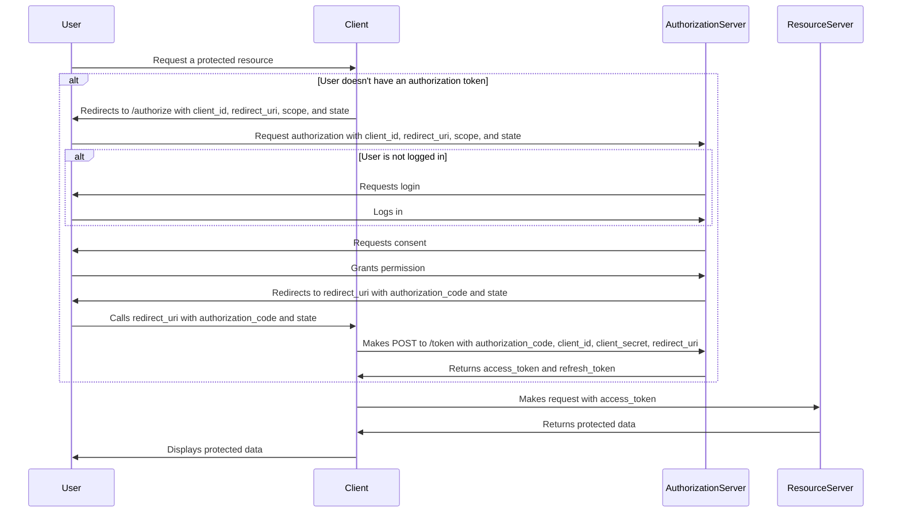

# OAuth2 Example

This project demonstrates a fully functional implementation of the **OAuth 2.0 Authorization Code Flow**, built with **Go** and structured as three independent services:

- 👤 **Client**: An application that consumes resources from the Resource Server, once authorized by the user.
- 🧠 **Authorization Server**: Handles authentication, consent, authorization, and token generation.
- 🔐 **Resource Server**: A service that provides protected resources, once authorized by the user.

---

## 🚀 Getting Started

### Prerequisites

- [Go](https://golang.org/dl/)
- [Docker](https://www.docker.com/)

### Environment Setup

1. Clone the repository:

```bash
git clone https://github.com/your-username/oauth2.git
cd oauth2
```

2. Start all services:

```bash
docker-compose up --build
```

---

## 🔐 OAuth 2.0 Authorization Code Flow

This system implements the **OAuth 2.0 Authorization Code Flow**, ideal for secure applications that need to access protected resources on behalf of a user. The diagram below illustrates the entire interaction:



---

### 1. User requests a protected resource

The client application provides a feature that requires access to a protected resource on the Resource Server. Since the resource is protected, a valid access token is required. If the user does not have one, the client initiates the OAuth 2.0 **Authorization Code Flow** to obtain it.

The client backend generates a `state` and stores it securely (in our implementation, we used a secure cookie). This `state` helps prevent CSRF attacks, ensuring the integrity and security of the OAuth 2.0 flow.

The backend then redirects the user to the Authorization Server's `/authorize` endpoint with the following parameters:

- `client_id`: Uniquely identifies the client application. Must be pre-registered with the Authorization Server.
- `redirect_uri`: The URL to redirect the user after authorization. Must be pre-registered to prevent open redirect attacks.
- `scope`: Specifies the permissions requested. Only the minimum necessary permissions should be requested.
- `state`: A CSRF protection mechanism. A random value is generated and persisted securely.
- `response_type`: Indicates the flow type (e.g., `code` for Authorization Code Flow).

Example:

```http
GET /authorize?response_type=code
  &client_id=example-client
  &redirect_uri=http://localhost:8081/callback
  &scope=read
  &state=random123
```

---

### 2. Client redirects to Authorization Server

Following the redirect, the Authorization Server is requested on `/authorize`.

At this point, Authorization Server identifies the client through the `client_id`, but in the **Authorization Code flow**, this first contact doesn't include the `client_secret`. Therefore, the Authorization Server cannot trust the client yet. Ahead we'll se the implications of this.

As the client was identified, Authorization Server will check if the client is asking something was previously agreed by the both.

- `redirect_uri` should be previously allowed by the client on registration. It prevents malicious actors from redirecting users to unauthorized or harmful endpoints, ensuring the integrity of the flow.
- `scope` should be previously agreed on registration. It prevents the client from requesting unauthorized or excessive permissions, ensuring that the user only grants access to what is necessary and expected.
- `response_type` also should be validated to ensure the client is using pre-agreed flow type. Different flows have varying levels of security, and it is crucial for the client to specify which flows it will accept during registration. This ensures that only the intended and secure flows are used, reducing the risk of vulnerabilities or unauthorized access.

OK, client is valid. At this point, it's time to handle the user. If the user already has a valid and active session (in our case, a non-expired JWT), the Authorization Server recognizes the user and we can proceed directly to the consent stage. Otherwise, the Authorization Server will redirect the user to the login page for authentication.

The redirect to the login page will carry all the params, to keep the authorization flow alive.

---

### 3. Authorization Server handles login

If the user is not already authenticated, the Authorization Server requires the user to log in. This step ensures that the user is properly identified before granting access to any protected resources. The login process typically involves presenting a username and password or using another authentication mechanism, such as multi-factor authentication (MFA), depending on the server's configuration. Once the user successfully logs in, the Authorization Server establishes a session for the user (in this case using a JWT stored in a secure cookie) to maintain their authenticated state for subsequent requests.

To continue the authorization flow, the user is again redirected to the `/authorize` endpoint, with the same params, but this time, authenticated (with a valid JWT token).

This time, as the user was identified, the next step is the consent. So there is a new redirect to the consent page.

---

### 4. Authorization Server asks for consent

Here, the user is presented with the details of the access request, including the client name and the requested scopes. The user must take the decision of aprove or deny the authorization request. So the following options are presented:

- **Approve**: Grant consent for the requested access.
- **Deny**: Reject the request, ending the flow.
- **Logout**: End their session and return to the login page.

Each one of the actions will redirect user to a different place.

- **Approve**: redirects to `/authorize` again, but now with a new param: a concent token.
- **Deny**: redirects to `/authorize` again, but now with a new param: an error message.
- **Logout**: redirects user back to login page.

The concent token was chosen in this implementation to keep the `/authorize` handler responsible to the whole process of authorization. A signed JWT token is a stateless way to ensure the parameter was not forged, as it can be verified without requiring server-side storage. This approach enhances scalability and security, ensuring that the consent decision is authentic and tamper-proof.

The concent token carry the `user_id`, `client_id`, `redirect_uri` and `scope` values, witch can be verified to ensure the integrity of the consent process.

---

### 5. Server redirects with an authorization code

On the last pass through the `/authorize`, now with the user properly identified and consented, the authorize process finishes.
But, as we cannot trust on the client on **Authorization Code flow**, we cannot reply the access token yet. Instead, we should reply an authorization code, that is randomly generated and persisted on Authorization Server (we use memory in this implementation for sake of simplicity, but consider something more resilient).

The authorization code doesn't release anything. It is an intermadiate code that client should send back to Authorization Server later to get the real access token.

The Authorization Sever store important information to continue the authorization process later, such as `client_id`, `redirect_uri`, `scope` and, of corse, `user_id`.

Besides authorization code, the Authorization Server replay back also the `state` client was sent, so client can trust on the reply.

If the user denies consent or any error occurs, an `error` parameter will be included in the redirect instead of authorization code.

---

### 6. Client exchanges code for access token

The second part of the **Authorization Code flow** must be handled in backend, since we'll exchange sensitive data with the Authorization Server.

The first step in the callback handler is validate the state against the previously stored (in a secure cookie, in our implementation). If state doesn't match, it's not secure to continue the process. Now is the time to exchange the authorization code with a access token, that will give access to the resource.

The client backend will make a POST request to `/token` on the Authorization Server passing the following fields in the body:

- `authorization_code` – this was the value received on callback request.
- `client_id` – the same that started the authorization process.
- `redirect_uri` – the same that started the authorization process.
- `grant_type=authorization_code` – specifies the way Authorization Server will fetch the user data. `authorization_code` is used on **Authorization Code flow**.
- `client_secret` – and finally we will share the client secret (that was previously agreed with Authorization Server).

The first part of the **Authorization Code flow** is done by redirecting, witch expose the values through the navigation. But on the second part, the request is done on backend, and now is safe enougth to share the `client_secret`.

Authorization Server will recover the process from authorization code, it will also validate the `client_id`, `redirect_uri` and now the `client_secret` in order to ensure that the client is authorized to access the requested resources. The `user_id` and `scope` are stored behind the authorization code.

We are ready to generate an access token (and refresh token) to `user_id`, scoped on `scope`, and for audience `client_id`. It's important to defines short TTL to access tokens and adequated TTL to refresh token.

Authorization Server respond:

```json
{
  "access_token": "access-token",
  "refresh_token": "refresh-token",
  "token_type": "Bearer",
  "expires_in": 3600
}
```

Client should store this data in a secure way. In this implementation we used secure cookies.

---

### 7. Client accesses the protected resource

Using the access token, the client now can request the protected resource from Resource Server.

```
GET /resource
Authorization: Bearer access-token
```

If the access token expires, it is possible get a new one while refresh token is valid. In this case, the `grant_type` for the `/token` request is `refresh_token`. The refresh token must be sent in this case. This part of flow was not implemented, and could be a next step of this demo project.

---

### 8. Resource Server validates token and returns data

Before delivery the protected resource, Resource Server should validate the access token. It's possible to ask Authorization Server to do that (witch is simpler but doesn't scale well), or we can use public key of the Authorization Server to validate the signature. For sake of simplicity, we used an static asymmetric key, but in production, it is important to rotate the keys. To do so, instead of store the public keys on Resource Server repository, the Authorization Server should expose them from a well-known endpoint. This approach ensures that the Resource Server always has the latest key for token validation, enhancing security and simplifying key rotation management.

Access token validated, the resource can be delivered and the client can use it according to the requested scope.

---

## Next steps

* Implement additional OAuth 2.0 flows, such as the refresh token flow, to enhance functionality and security.

## 📜 License

MIT License
